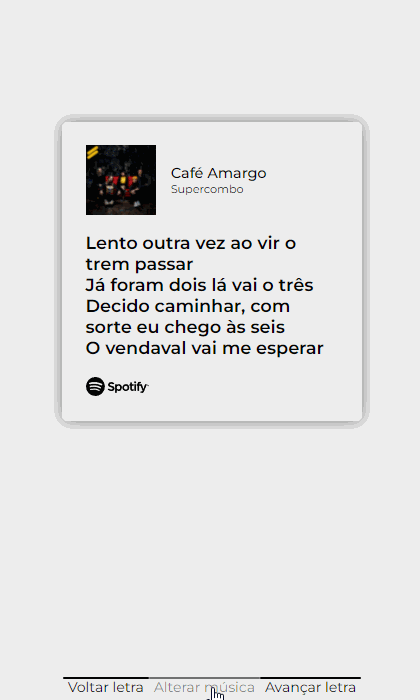

# Spotify Lyrics Card Generator

[PT-BR] Aplicação simples em web para gerar os cards com as letras das músicas como no app do Spotify. Funciona localmente, e com o gerenciamento de estados do próprio React.

[EN] Simple web app that can generate cards and change themes just like in Spotify app. Works locally, with native React state management tools.

## Demonstração / Demo

[PT-BR] Não tenho direitos sobre nenhuma música, letra, logotipo, design, imagem ou qualquer mais relacionado na criação deste app. Apenas para fins de estudo. Se algum dos proprietários deseja a remoção do conteúdo, entre em contato e será removido.

[EN] I do not know any right about any song, lyric, logo, design, image or anything used to create this app. Just for study purposes. If any of the owners of the materials want them removed, contact me and it will be removed.

## Versão / Version

0.3

### 💻 Desenvolvido por Vinícius Fernandes

 
